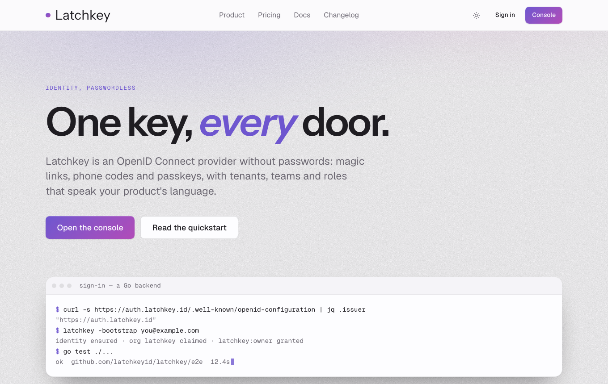

# @latchkey/www

One design and one set of Astro layouts for the product marketing sites
— **latchkey**, **tripline**, **runsheet**, **wardroom**, **purser**,
**foghorn**, **Project Mesh** and **thirtysixzero**. The sibling of
[`@latchkey/shell`](https://github.com/latchkeyid/shell), which does the
same for the consoles: the same mauve neutral, the same accent per
product, so "Console" in the nav lands somewhere that looks like where
you came from. Each site differs only in its accent file and the copy.



Astro 7 · Tailwind v4 · static output on Cloudflare Pages · no framework
runtime (two tiny inline scripts: the theme class and reveal-on-scroll).
The design contract is [`docs/DESIGN.md`](docs/DESIGN.md); the evidence
behind it is [`docs/research/trends.json`](docs/research/trends.json);
every product's accent on the same page is in `docs/screenshots/`.

## Rolling it out

`docs/adopt/` is the handover — start at `HANDOVER.md` (the rule, the
status of every product, what was learned, the order). Then `COMMON.md` (the rules for any site),
`ROLLOUT.md` (order and status — latchkey, then foghorn, purser,
wardroom, tripline, runsheet, Project Mesh, thirtysixzero), and one brief per site with what differs.

## Start a site

```sh
npx degit latchkeyid/www/template my-www && cd my-www
npm install
```

Then, in order:

1. `src/styles/global.css` — change the accent import to your product
   (`@latchkey/www/theme/<product>.css`).
2. `src/site.ts` — the product id (from `house.ts`), nav, footer columns.
3. `src/pages/index.astro` — the copy. Every line in the template is
   placeholder, prices included.
4. Delete `src/components/ThemeSwitcher.astro` and its uses — it exists
   so the playground can show every accent on one build.
5. `package.json` — the `deploy` script's Pages project name; the
   dependency to `"github:latchkeyid/www#<sha>"`.

`npm run dev` on :4321. `npm run build` writes `dist/`; `npm run deploy`
is `wrangler pages deploy dist`.

## What is in the package

- `theme/base.css` — the tokens (the shell's 12-step mauve scale, light
  and dark tuned separately), the reading type scale (17px body, fluid
  display sizes), and the finish: `display-1/2/3`, `display-accent`,
  `eyebrow`, `glow`, `grain`, `glass`, `gradient-text`, `rule-accent`,
  `reveal`, `.btn*`, `.prose`.
- `theme/<product>.css` — the accent: `--primary`, `--primary-foreground`,
  `--accent-2` (the gradient's second stop), `--accent-soft`, `--ring`,
  for light and dark. The six console products' files are the shell's,
  verbatim (`npm run sync-accents`).
- `theme/fonts.css` — Geist Sans and Mono (the console's) and
  Instrument Sans for display (a sans with a true italic), self-hosted, OFL.
- `layouts/Site.astro` — head (title, description, canonical, OG,
  JSON-LD), the theme class before first paint, `Nav`, `Footer` with the
  house ring, the reveal observer. `layouts/Docs.astro` — the same with a
  sticky left nav and a prose column.
- `components/` — `Hero`, `Section`, `Features`/`Feature`,
  `Bento`/`BentoCell`, `Steps`/`Step`, `Pricing`/`PricingTier`,
  `Faq`/`FaqItem`, `Cta`, `LogoCloud`, `Stats`/`Stat`, `Window`,
  `Terminal`, `CodeBlock`, `Testimonial`, `Badge`, `Button`, `Eyebrow`,
  `Container`, `Prose`, `ThemeToggle`, `Nav`, `Footer`.
- `house.ts` — every product with its accent, URL and console, for the
  footer ring and the playground.

Headlines take one accent word in `*asterisks*`: `title="One key, *every*
door."` renders the word italic in the product colour.

## Development

```sh
npm install            # root: Playwright
npm run dev            # the template on :4321, ?theme=<product> switches the accent
npm run screenshots    # builds the template, shoots every theme light/dark + docs/pricing/phone
npm run sync-accents   # copy the six console accents from ../shell
```

Screenshots are the review: `docs/screenshots/<product>-{light,dark}.png`
for all eight, `latchkey-full.png` for the whole page, `docs-dark`,
`pricing-light`, `changelog-light`, `foghorn-phone`.
